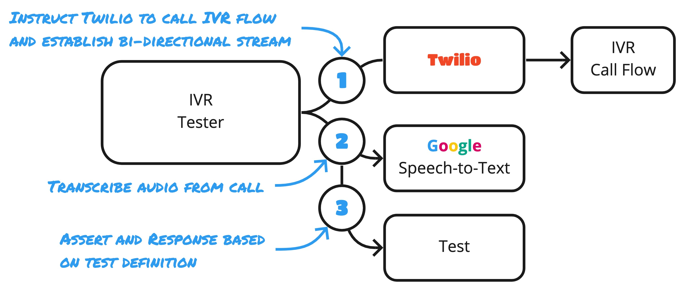

# IVR Tester

[](https://www.npmjs.com/package/ivr-tester)
[](https://lgtm.com/projects/g/SketchingDev/ivr-tester/context:javascript)

[](https://app.fossa.com/projects/git%2Bgithub.com%2FSketchingDev%2Fivr-tester?ref=badge_shield)

<p align="center">
  Automate the testing of your IVR call flows!
</p>

IVR Tester automates the testing of IVR flows by calling them, interpreting prompts and replying with DTMF tones based
on fluent test definitions.

<p align="center">
  
</p>

Features:
* Fully automates testing call flows
* Test multiple scenarios in parallel
* Expressive test definitions help document call flow
* Record audio of tests
* Record transcriptions of tests
* Supports Google Speech-to-Text and AWS Transcript for transcribing calls
* Open-source

```typescript
const config = { transcriber: googleSpeechToText({ languageCode: "en-GB" }) };

new IvrTester(config).run(
  { from: "0123 456 789", to: "0123 123 123" },
  {
    name: "Customer is provided a menu after their account number confirmed",
    steps: [
      {
        whenPrompt: similarTo("Please enter your account number"),
        then: press("184748"),
        silenceAfterPrompt: 3000,
        timeout: 6000,
      },
      {
        whenPrompt: similarTo(
          "press 1 for booking a repair or 2 for changing your address"
        ),
        then: hangUp(),
        silenceAfterPrompt: 3000,
        timeout: 6000,
        },
     ],
  }
);
```

## Quick Start

1. [Create a Twilio account](https://www.twilio.com/referral/9E7LvU) (referral link for $10 free if you upgrade), load it with money and rent a phone number
   1. Store an [authentication token](https://support.twilio.com/hc/en-us/articles/223136027-Auth-Tokens-and-How-to-Change-Them) in environment variables:
   ```shell
   export TWILIO_ACCOUNT_SID=ACXXXXXXXXXXXXXXXXXXXXXXXXXXXXXXXX
   export TWILIO_AUTH_TOKEN=your_auth_token
   ```
1. Configure your environment for either [Google](packages/transcriber-google-speech-to-text) or [Amazon's](packages/transcriber-amazon-transcribe) transcription service
1. Install and start ngrok
   ```shell
   npm install ngrok -g
   ngrok http 8080
   ```
1. Run the tests
   ```shell
   # Local port that IVR Tester will listen on
   export LOCAL_SERVER_PORT=8080
   # URL that ngrok exposes to the outside world
   export PUBLIC_SERVER_URL=$(curl -s localhost:4040/api/tunnels | jq -r .tunnels[0].public_url)

   node test.js
   ```

## How it works

<p align="center">
  
</p>

Under the hood this orchestrates:
 1. Establishing a bi-directional audio stream of the call to the IVR flow - using [Twilio](https://www.twilio.com/)
 1. Transcribing the voice responses from the flow - using [Google Speech-to-Text](https://cloud.google.com/speech-to-text)
 1. Using the test to conditionally respond with DTMF tones to transcripts

## Writing tests

| When         | Overview                             |
| -------------|--------------------------------------|
| [contains]   | Prompt contains a piece of text      |
| [matches]    | Prompt matches regular expression    |
| [similarTo]  | Prompt is similar to a piece of text |
| [isAnything] | Prompt can be anything               |

[contains]: ./packages/ivr-tester/doc#contains
[matches]: ./packages/ivr-tester/doc#matches
[similarTo]:  ./packages/ivr-tester/doc#similarto
[isAnything]: ./packages/ivr-tester/doc#isanything

| Then        | Overview            |
| ------------|---------------------|
| [press]     | Produces DTMF tones |
| [hangUp]    | Terminates the call |
| [doNothing] | Doesn't do anything |

[press]: ./packages/ivr-tester/doc#press
[hangUp]: ./packages/ivr-tester/doc#hangup
[doNothing]: ./packages/ivr-tester/doc#donothing

## Development

### Documentation

Where possible the documentation is generated from the code using the following script in the root directory or
individual packages:

```shell
yarn docs
```

The documentation is automatically generated and committed as part of the CI pipeline when merged to the main branch.

The official website can be previewed locally by running:

```shell
docsify serve docs
```

## License

[](https://app.fossa.com/projects/git%2Bgithub.com%2FSketchingDev%2Fivr-tester?ref=badge_large)
