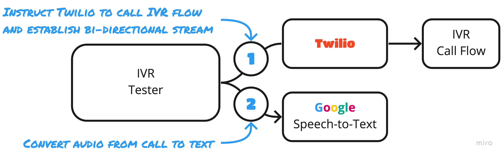

# IVR Tester


[](https://lgtm.com/projects/g/SketchingDev/ivr-tester/context:javascript)

WARNING: This project is under heavy development so APIs are likely to change.

An automated testing framework for Interactive Voice Response (IVR) call flows.

IVR Tester calls a phone number and impersonates a human. It does this by automatically transcribing voice responses
to text and then uses these, along with a test definition, to determine how it should respond. A successful test is one
that manages to navigate a call flow using all of its conditions.

```typescript
testRunner()(
  { from: "0123 456 789", to: "0123 123 123" }, 
  { name: "Customer is asked to provide account number",
    test: ordered([
      {
        when: similarTo("Press 1 to update your account details"),
        then: press("1"),
      },
      {
        when: contains("enter your account number"),
        then: doNothing(),
      },
    ]),
  },
  { name: "Customer is told their option is unrecognised",
    test: ordered([
      {
        when: similarTo("Press 1 to update your account details"),
        then: press("2"),
      },
      {
        when: similarTo("Sorry, we did not understand your response"),
        then: doNothing(),
      },
    ]),
  }
);
```

## How it works

<p align="center">
  
</p>

Under the hood this orchestrates: 
 1. Establishing a bi-directional audio stream of the call to the IVR flow - using [Twilio](https://www.twilio.com/)
 1. Transcribing the voice responses from the flow - using [Google Speech-to-Text](https://cloud.google.com/speech-to-text)
 1. Using the test to conditionally respond with DTMF tones to transcripts

## Getting Started

The first 3 steps take you through configuring IVR Tester's dependencies, which are:
* [Twilio](https://www.twilio.com/) - This calls your IVR flow and connects the bi-directional audio stream to the server IVR Tester hosts on the
machine it runs on
* [Google Cloud Speech-to-Text](https://cloud.google.com/speech-to-text) - This performs the speech-to-text conversion
* [ngrok](https://ngrok.com/) - Run locally this exposes IVR Tester's server to the internet so Twilio can access it

1. Configure your [authentication token for Twilio](https://support.twilio.com/hc/en-us/articles/223136027-Auth-Tokens-and-How-to-Change-Them)
   
   _These are used to instructing Twilio to call your IVR flow.
   Remember to [keep your auth token secret](https://www.twilio.com/blog/protect-phishing-auth-token-fraud)._
   
   ```shell
   export TWILIO_ACCOUNT_SID=ACXXXXXXXXXXXXXXXXXXXXXXXXXXXXXXXX
   export TWILIO_AUTH_TOKEN=your_auth_token
   ```

2. Setup Google Cloud's Speech-to-Text service 
   Follow GCP's [quick-start guide](https://cloud.google.com/speech-to-text/docs/quickstart-client-libraries) to:
   1. Setup a Google Cloud project
   2. Create a service account, then set the environment variable to the path of the JSON file that contains the service account's key.

   ```shell
   export GOOGLE_APPLICATION_CREDENTIALS=/path/to/key.json
   ```

3. Install and start [ngrok](https://ngrok.com/)

   1. [Install ngrok](https://ngrok.com/download)
   2. Run ngrok - we'll only be using its basic features, so you don't need to signup
       ```shell
       ngrok http 8080
       ```
   
2. Run the tests

   1. Set the port IVR Tester should listen on for calls. This is the port that you told ngrok to forward connections
      to in step 3.2 above 
      ```shell
      export LOCAL_SERVER_PORT=8080
      ```
   2. Set the public URL that ngrok created for us in step 3.2 above. We can use it's API to retrieve this for us,
      otherwise it will be available in ngrok's console output
      ```shell
      export PUBLIC_SERVER_URL=$(curl -s localhost:4040/api/tunnels | jq -r .tunnels[0].public_url)
      ```
   3. Execute your test
      ```
      node test.js
      ```

## Writing tests

### Reducing flakiness

Automatically transcribing speech to text is not an accurate process, so you have to be careful about how you define 
your `when` clauses. A spoken sentence such as:

```
Please enter your date of birth
```

Could be transcribed as:

```
please entreat your date of birth
```

This introduces flakiness into your tests and puts importance on the balancing act of making your tests readable, whilst
being resilient to inaccuracies. In this example since being asked to **enter** your date of birth is important
to understanding the flow I would use `similarTo`, which matches based on a degree of similarity: 

```typescript
{
  when: similarTo("Please enter your date of birth"),
  then: press("18121985"),
}
```

Instead of say `contains` which would hide the fact a question is being asked to a casual observer of the test:

```typescript
{
  when: contains("date of birth"),
  then: press("18121985"),
}
```

## Development

### How to publish a release

1. Merge functionality to master along with an increase in the package's version
2. Create a release in GitHub - the version will be the package's version prefixed with 'v'

Creating the release with trigger the [GitHub workflow](.github/workflows/on-main.yml) that will publish to npmjs.com
